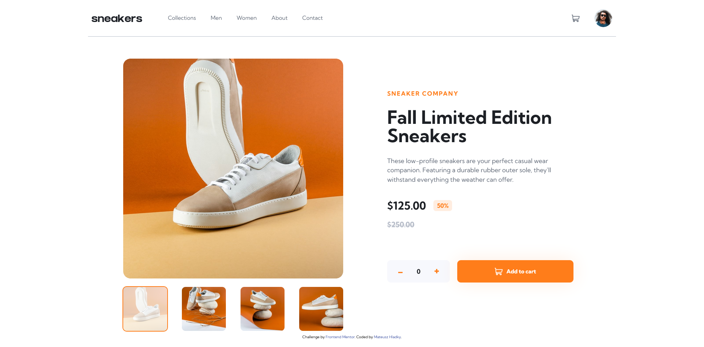

# Frontend Mentor - E-commerce product page solution

This is a solution to the [E-commerce product page challenge on Frontend Mentor](https://www.frontendmentor.io/challenges/ecommerce-product-page-UPsZ9MJp6). Frontend Mentor challenges help you improve your coding skills by building realistic projects.

## Table of contents

-   [Overview](#overview)
    -   [The challenge](#the-challenge)
    -   [Screenshots](#screenshots)
    -   [Links](#links)
-   [My process](#my-process)
    -   [Built with](#built-with)
    -   [Useful resources](#useful-resources)
-   [Author](#author)

## Overview

### The challenge

Users should be able to:

-   View the optimal layout for the site depending on their device's screen size
-   See hover states for all interactive elements on the page
-   Open a lightbox gallery by clicking on the large product image
-   Switch the large product image by clicking on the small thumbnail images
-   Add items to the cart
-   View the cart and remove items from it

### Screenshots

### Links

-   [Solution](https://www.frontendmentor.io/solutions/ecommerce-product-page-using-scss-js-and-glidejs-AE3YOAnOHV)
-   [Live Site](https://mateuszhladky.netlify.app/projects/ecommerce-product-page/)

## My process

### Built with

-   Semantic HTML5 markup
-   SASS/SCSS
-   Flexbox
-   CSS Grid
-   Mobile-first workflow
-   JS
-   [Glide.js](https://glidejs.com/)

### Useful resources

-   [Glide.js](https://glidejs.com/) - This JS library made sliders very easy to do. It also has its own API which I used in this project. For anyone looking for a slider library I would definetely pick this one!

## Author

-   Website - [Mateusz Hladky](https://mateuszhladky.netlify.app)
-   Frontend Mentor - [@matibox](https://www.frontendmentor.io/profile/matibox)
-   Twitter - [@m4t1box](https://www.twitter.com/m4t1box)
